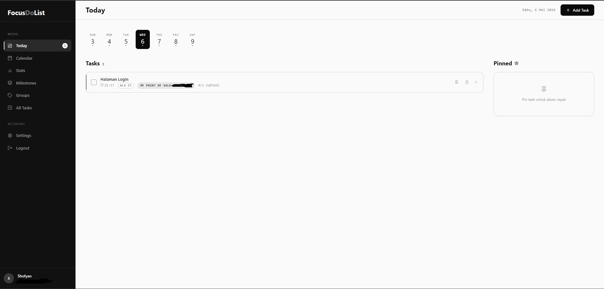

# FocusDoList — Monochrome Productivity Suite

FocusDoList adalah aplikasi manajemen produktivitas minimalis dengan estetika monokrom yang bersih. Dibangun menggunakan **React 18**, **TypeScript**, dan **Vite**, aplikasi ini menawarkan pengalaman pengguna yang fokus, elegan, dan aman.

## 🚀 Fitur Utama

### 1. Zero-Knowledge Secure Notes (E2EE) 🔐
Fitur unggulan untuk menyimpan catatan sensitif dengan konsep **End-to-End Encryption**.
- **Client-Side Encryption**: Data dienkripsi di browser menggunakan Web Crypto API (AES-GCM) sebelum dikirim ke server.
- **Key Derivation**: Kunci enkripsi diturunkan dari password/PIN vault menggunakan PBKDF2 (100,000 iterations).
- **Privacy First**: Backend hanya menyimpan ciphertext. Kami tidak pernah melihat plaintext atau password Anda.
- **Secure Vault**: Akses catatan memerlukan PIN vault setiap sesi.

### 2. Milestone-Linked Todos 🏁
Pantau kemajuan proyek jangka panjang dengan integrasi tugas.
- **Progress Tracking**: Persentase kemajuan milestone dihitung otomatis dari penyelesaian tugas yang terhubung.
- **Dynamic Connection**: Hubungkan tugas ke milestone tertentu melalui dropdown atau multi-select.
- **Visual Clarity**: Badge milestone pada daftar tugas untuk navigasi cepat.

### 3. Comprehensive Task Management 📋
- **Today Dashboard**: Fokus pada tugas hari ini dengan kalender mingguan.
- **Advanced Filters**: Filter tugas berdasarkan status, prioritas, dan pencarian teks.
- **Sub-tasks & Reminders**: Pecah tugas menjadi langkah kecil dan setel pengingat notifikasi.
- **Pinned Tasks**: Akses cepat ke tugas terpenting Anda.

### 4. Productivity Analytics 📈
- **Activity Heatmap**: Visualisasi intensitas penyelesaian tugas dalam 35 hari terakhir.
- **Priority Breakdown**: Grafik distribusi tugas berdasarkan tingkat urgensi.

## 🛠️ Tech Stack

- **Framework**: [React 18](https://reactjs.org/) (TypeScript)
- **Build Tool**: [Vite](https://vitejs.dev/)
- **State Management**: [Zustand](https://github.com/pmndrs/zustand) (Auth, UI, Toasts, E2EE Vault)
- **Data Fetching**: [TanStack Query v5](https://tanstack.com/query/latest)
- **Security**: Web Crypto API (AES-GCM, PBKDF2)
- **Styling**: Vanilla CSS (Custom Design System)
- **Icons**: [Lucide React](https://lucide.dev/)
- **Date Utilities**: [date-fns](https://date-fns.org/)

## 📦 Instalasi Lokal

1. **Clone Repository**
   `bash
   git clone https://github.com/username/todo-frontend.git
   cd todo-frontend
   `

2. **Install Dependencies**
   `bash
   npm install
   `

3. **Konfigurasi Environment**
   Salin file .env.example menjadi .env:
   `bash
   cp .env.example .env
   `
   Pastikan VITE_API_URL mengarah ke backend Laravel Anda.

4. **Jalankan Aplikasi**
   `bash
   npm run dev
   `
   Buka [http://localhost:5173](http://localhost:5173).

## 📄 Keamanan & Praktik Terbaik

- **Zero-Knowledge Architecture**: Password vault Anda tidak pernah dikirim ke server.
- **Secure Storage**: Token autentikasi disimpan di localStorage (via Axios Interceptors).
- **Type Safety**: Implementasi TypeScript yang ketat untuk skalabilitas kode.
- **Clean Documentation**: .gitignore dikonfigurasi untuk melindungi file sensitif.

---
Dibuat dengan ❤️ untuk produktivitas yang lebih fokus dan aman.
